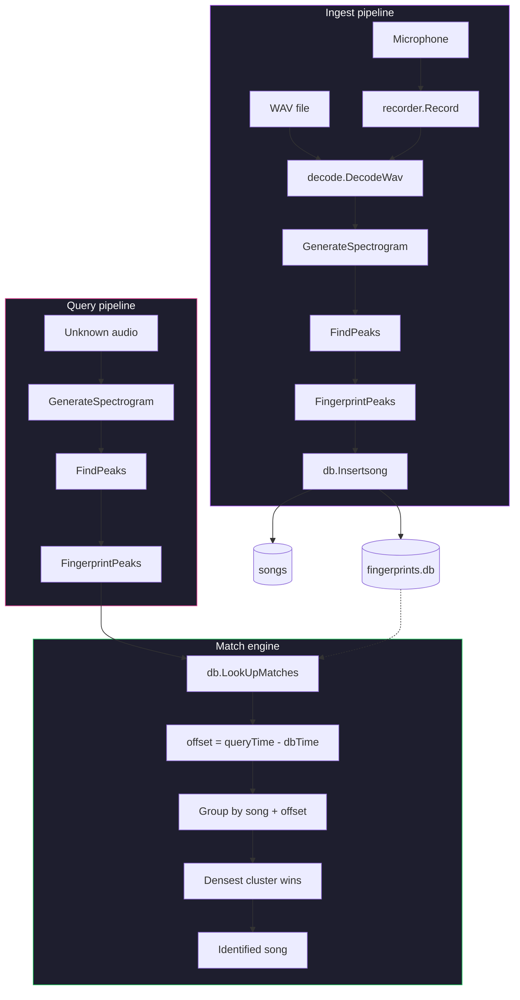

# ♪ Audio Fingerprint

<p>
  
  
  
</p>

Shazam-style music identification engine built in Go. Recognise songs from short microphone recordings or audio files using spectrogram constellation fingerprinting and offset-aligned hash matching.

---

## Features

- **Spectrogram fingerprinting** — sliding FFT with Hann window (4096 samples, 512 hop) generates a time-frequency energy grid
- **Constellation extraction** — local maxima peak finding with configurable neighbourhood and magnitude threshold
- **Combinatorial hashing** — pair peaks within a target zone, pack `(freq1, freq2, Δt)` into a compact `uint32` hash
- **Offset-aligned matching** — group by song and time offset; the densest offset cluster identifies the match
- **SQLite storage** — indexed hash lookups with transactional batch inserts
- **Browser recording** — capture audio via the Web Audio API, encode to WAV, and match server-side
- **PortAudio capture** — CLI microphone recording on desktop
- **CLI + Web UI** — full-featured command-line interface and a clean browser-based SPA

---

## Architecture



---

## How it works

### 1. Audio decoding — `internal/audio/decode.go`

WAV files are parsed by reading the RIFF header to extract channel count, sample rate, and bits per sample, then locating the `data` chunk (some files have intermediate `fmt `, `fact`, or `LIST` chunks). Raw PCM samples are converted from `int16` to `float64`, stereo pairs are averaged to mono, and the result is normalised to the `[-1, 1]` range.

### 2. Spectrogram — `internal/fingerprint/spectogram.go`

The normalised samples are divided into overlapping frames using a sliding Hann window:

| Parameter | Value | Reason |
|-----------|-------|--------|
| Window size | 4096 samples | ~93 ms at 44.1 kHz — good frequency resolution |
| Hop size | 512 samples | 87.5% overlap — fine time resolution for matching |
| Frequency range | All bins (up to Nyquist) | Peaks naturally selected by magnitude threshold |

Each windowed frame is run through an FFT (via `gonum`), and the magnitude `√(real² + imag²)` is computed for every frequency bin, producing a 2D time-frequency energy grid. A PNG spectrogram image can be exported for visual inspection.

### 3. Constellation map — `internal/fingerprint/peaks.go`

Each cell in the spectrogram grid is tested against its neighbours over a rectangular window of `±10` time frames and `±10` frequency bins. If the centre cell is strictly greater than every neighbour and exceeds a minimum magnitude threshold of `0.1`, it is registered as a **peak**. The result is a sparse set of `(time, frequency, magnitude)` points — the constellation map.

Peaks are robust to noise: adding background sound may shift magnitudes but the same prominent peaks survive, which is what makes matching possible from short, noisy recordings.

### 4. Fingerprint hashing — `internal/fingerprint/hash.go`

Each peak acts as an **anchor**. The next `5` peaks in time order (the fan-out target zone) are paired with the anchor, and for each pair a combined hash is computed:

```
hash = (freq_anchor << 21) | (freq_target << 10) | delta_time
```

The bit layout packs ~11 bits for each frequency bin and ~10 bits for the time delta into a compact `uint32`. The anchor's absolute time is also stored separately — this is what enables offset alignment during matching.

A 3-minute song at 44.1 kHz typically produces tens of thousands of fingerprints. Each fingerprint is a single row in the database.

### 5. Database — `internal/storage/db.go`, `store.go`

SQLite stores two tables:

```
songs          fingerprints
┌──────────┐   ┌──────────────────────┐
│ id (PK)  │   │ hash (indexed)       │
│ name     │   │ anchor_time          │
└──────────┘   │ song_id → songs.id   │
               └──────────────────────┘
```

The `hash` column is indexed for fast lookup. Fingerprints are inserted in a single transaction with a prepared statement for performance.

### 6. Matching — `internal/storage/query.go`

This is the core insight that makes Shazam work. Given a fingerprint set from unknown audio:

1. For each query fingerprint, look up all matching `(song_id, anchor_time)` rows with the same hash
2. Compute the **offset**: `query_anchor_time - db_anchor_time`
3. Group results by `song_id`, then within each song group offsets into clusters
4. The song with the largest offset cluster is the match

Why offset clustering matters: a correct match produces many hash collisions at the same time offset (because the same peaks appear at the same relative positions in both the original and the recording). An incorrect song produces random, scattered offsets. This makes the system highly selective even with short queries.

### 7. Recording — `internal/audio/record.go`

PortAudio captures raw float64 samples from the default microphone at 44.1 kHz. The output is identical in format to `DecodeWav`, so the same fingerprinting pipeline can process it directly.

---

## Screenshots

### Web UI


### Spectrogram


### Constellation Map

*Coming soon — visualisation of extracted peaks overlaid on the spectrogram.*

---

## Quick start

```bash
# Build
CGO_ENABLED=1 go build -o audio-fp ./cmd/audio-fp/

# Add a song
./audio-fp add-song song.wav "Song Name"

# Match a file
./audio-fp match unknown.wav

# Record from mic and match
./audio-fp listen 5

# Start web UI
./audio-fp serve
```

Batch-add an entire folder:

```bash
for f in /path/to/songs/*.wav; do
  name="$(basename "$f" .wav)"
  ./audio-fp add-song "$f" "$name"
done
```

---

## CLI usage

```
Commands:
  add-song <file.wav> <name>   Fingerprint a WAV file and store it
  match    <file.wav>           Match a WAV file against the database
  listen   [duration]           Record N seconds from mic and match
  list                          List all fingerprinted songs
  serve                         Start the web UI on :8082
```

---

## Web UI

```bash
./audio-fp serve
```

Open `http://localhost:8082`. Three tabs:

| Tab | Description |
|-----|-------------|
| **Identify** | Records 5s from the browser mic, builds a WAV in memory, sends it to `/api/match`, shows the result |
| **Add Song** | Upload a `.wav` with a name — fingerprints and stores it |
| **Library** | Lists every fingerprinted song in the database |

---

## REST API

| Method | Endpoint | Description |
|--------|----------|-------------|
| POST | `/api/add-song` | Multipart form: `file` (WAV) + `name` (string) |
| POST | `/api/match` | Multipart form: `file` (WAV) |
| GET | `/api/songs` | Returns JSON array of all song names |

**Response formats:**

```json
// POST /api/add-song
{ "status": "ok", "song": "Song Name" }

// POST /api/match
{ "status": "matched", "match": "Song Name" }
// or
{ "status": "no match" }

// GET /api/songs
{ "songs": ["Song A", "Song B"] }
```

---

## Project structure

<details>
<summary>Click to expand</summary>

```
audio/
├── cmd/audio-fp/
│   └── main.go             # CLI entry point with subcommands
├── internal/
│   ├── audio/
│   │   ├── decode.go       # WAV parsing, stereo-to-mono, normalisation
│   │   └── record.go       # PortAudio microphone capture
│   ├── fingerprint/
│   │   ├── spectogram.go   # FFT spectrogram, image export, sine wave generator
│   │   ├── peaks.go        # Constellation map peak finding
│   │   └── hash.go         # Peak pairing and fingerprint hashing
│   ├── pipeline/
│   │   └── ingest.go       # IngestPipeline, MatchFile, MatchRecording
│   ├── storage/
│   │   ├── db.go           # SQLite schema initialisation
│   │   ├── store.go        # Insert songs + fingerprints
│   │   └── query.go        # Hash lookup with offset alignment scoring
│   └── web/
│       └── server.go       # HTTP server with JSON API endpoints
├── web/static/
│   └── index.html          # Browser-based recording SPA
├── testdata/               # Test files (per-package subdirectories)
├── fingerprints.db         # SQLite database (auto-created, symlinked)
├── Dockerfile              # Container image
├── docker-compose.yml      # Container deployment
├── go.mod / go.sum
└── README.md
```

</details>

---

## Parameters

| Parameter | Location | Value | Effect |
|-----------|----------|-------|--------|
| Window size | `internal/fingerprint/spectogram.go` | 4096 | Frequency resolution per FFT frame |
| Hop size | `internal/fingerprint/spectogram.go` | 512 | Time resolution (overlap) |
| Neighbour window | `internal/fingerprint/peaks.go` | ±10 bins | Peak isolation radius |
| Min magnitude | `internal/fingerprint/peaks.go` | 0.1 | Filters low-energy noise peaks |
| Fan-out | `internal/fingerprint/hash.go` | 5 | How many target peaks each anchor pairs with |

---

## Dependencies

| Package | Role |
|---------|------|
| `gonum.org/v1/gonum` | FFT computation |
| `modernc.org/sqlite` | Pure-Go SQLite driver (no CGO) |
| `github.com/gordonklaus/portaudio` | Microphone capture |

System dependency: `portaudio19-dev` (Debian/Ubuntu) or `portaudio-devel` (Fedora).

---

## Database

`fingerprints.db` is created automatically in the working directory.

```bash
# Count songs
sqlite3 fingerprints.db "SELECT COUNT(*) FROM songs"

# Count fingerprints
sqlite3 fingerprints.db "SELECT COUNT(*) FROM fingerprints"

# Fingerprints per song
sqlite3 fingerprints.db "
  SELECT name, COUNT(*) AS fingerprints
  FROM songs JOIN fingerprints ON songs.id = fingerprints.song_id
  GROUP BY songs.id ORDER BY fingerprints DESC
"
```

---

## Future improvements

- [ ] **Offset alignment scoring** — stricter cluster analysis with confidence thresholds
- [ ] **Noise filtering** — adaptive magnitude thresholds for cleaner peak extraction
- [ ] **Peak density tuning** — dynamic fan-out based on local peak density
- [ ] **Database export/import** — share fingerprint databases between instances
- [ ] **Continuous listening mode** — real-time matching loop from microphone
- [ ] **Multiple format support** — MP3, FLAC, OGG via `golamext` or ffmpeg piping
- [x] **Docker image** — deploy as a containerised service

---

## License

MIT
